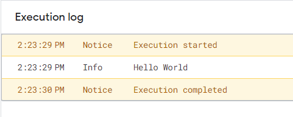
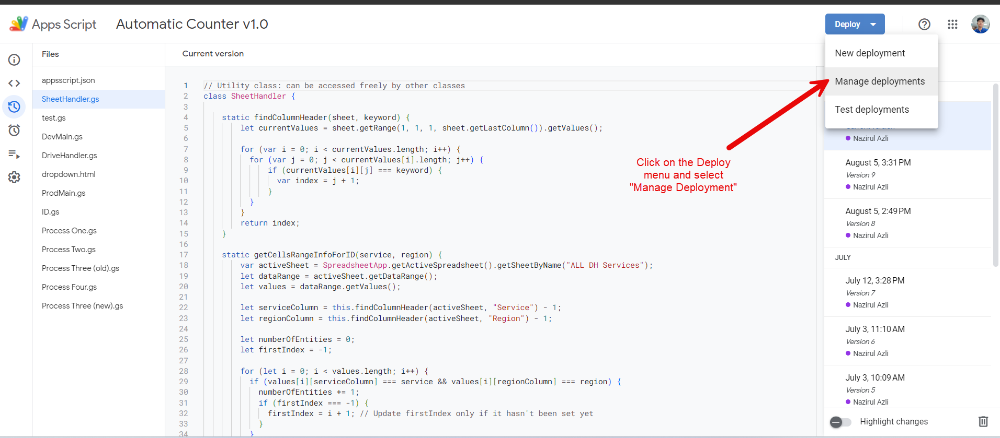
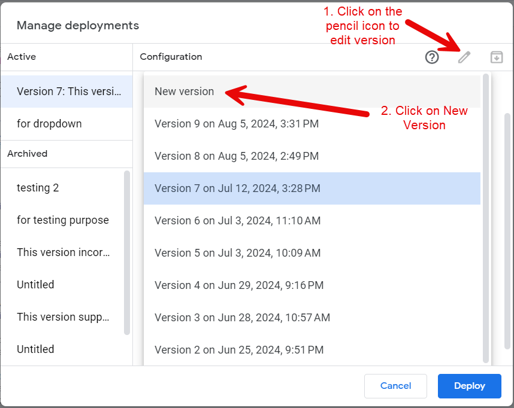
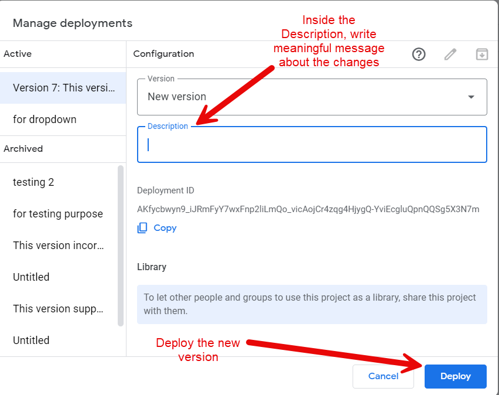
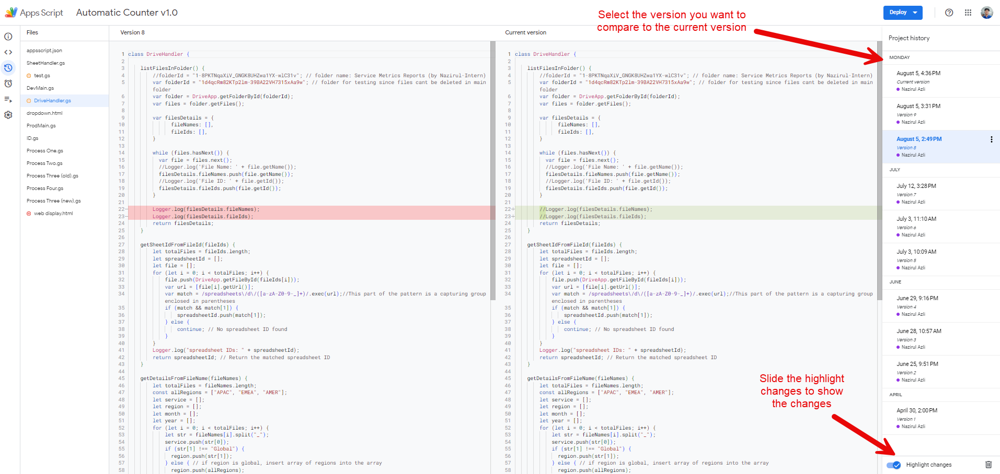
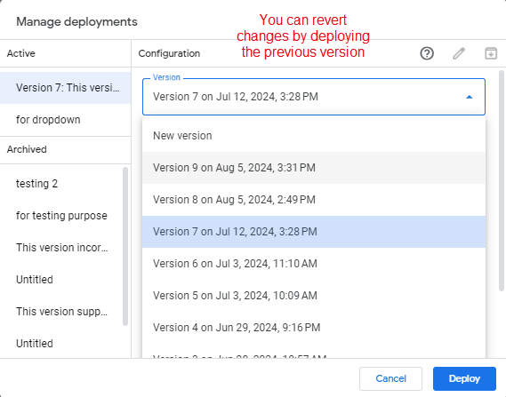
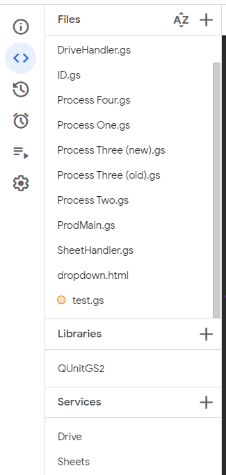
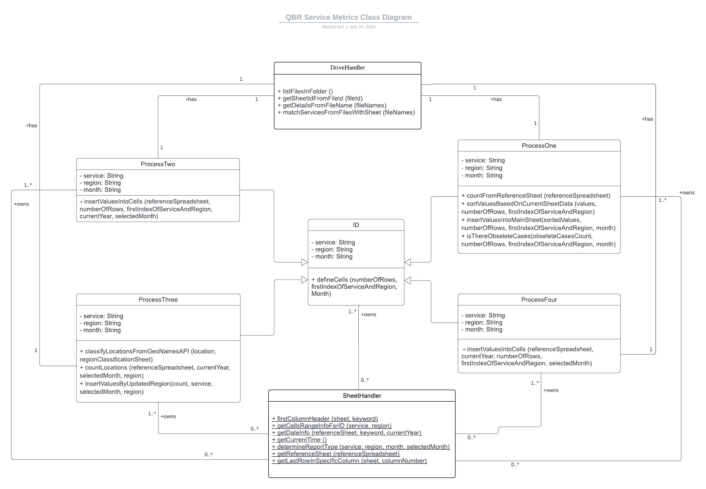

# Apps Script Automation for QBR Service Metrics

  

  Automation Count Feature in Google Sheets

## Project Description
This project is an automation feature for counting process for QBR Service Metrics. It utilizes Google Apps Script (GAS) as the scripting tool, Google Sheets as data storage, and Google Drive as centralized files storage. It also integrates indirectly Google Sheets and Google Drive services via built-in APIs provided in GAS.

## Requirements
To contribute to this project, the following requirements must be met:
- Access to Google Sheets development & testing environment
- Access to Google Drive development & testing environment
- Basics about JavaScript and HTML

No installation or extension is required

## Usage Instructions
To begin developing this project, please follow the setup instructions below:
1. Open the Google Sheets Development & Testing environment
2. Click on the extension menu
3. Choose the Apps Script (a script called Code.gs will be auto created and deployed by default)
4. Have fun developing the script~

## Available Features
In GAS, there are multiple tools that can be utilized to maximize the efficiency of the script.

### 1. Execution Log
GAS offers a feature for the developers to check the variables' values by logging them inside the execution log using `Logger.log()`

Example: `Logger.log('Hello World')`;

The result of the logging will appear in the execution log interface

This is useful for debugging process in case you prefer to debug manually without using debugger tool

### 2. Project History
GAS offers a small scale version control to save the script, track the changes, and revert previous version. 

  1. Saving the script via new deployment
     - To save the script, we can deploy it as a new version
       

       

     - When creating new version, it is a good practice to include meaningful description in present tense form
        

     For every big changes made into the script, it is a good practice to create new version
       
  
  2. Track the changes

  
    
  
  3. Restore the previous version

     

     Warning: Please ensure that the current script is already up-to-date with the current version so that changes in the current script would not be lost
   

### 3. Services and Library

  

GAS offers services as built-in APIs for developers to interact programmatically with the systems of Google products. Instead of using API keys containing the URL, these services can be called with the same syntax as classes

1. **SpreadsheetApp service**

    This is a service to interact with the Google Sheet system.

  
    To use this service, we can call it using the keyword of `SpreadsheetApp`

  
    Examples:
  
    `var activeSheet = SpreadsheetApp.getActiveSpreadsheet().getSheetByName("ALL DH Services");`
  
    `const referenceSpreadsheet = SpreadsheetApp.openById(filteredSheetIds[i]);`

   
   
2. **DriveApp service**

   
    This is a service to interact with the Google Drive system
   

    To use this service, we can call it using the keyword of `DriveApp`

    Examples:

    `var folder = DriveApp.getFolderById(folderId);`

    `DriveApp.getFileById(fileIds[i]);`

For further functionalities, you may explore them in the Google Sheets API and Google Drive API documentations provided in the Resources

## GeoNames API Utilization

This is an external public API to fetch the data for region codes. Please ensure the utilization of this API complies with the security policy of Roche.

  1. **GeoNames Username**
  
  To use the API, we need to register and login our username and password in the GeoNames website.

  Then, we need to declare our username.
  
  Warning: please ensure the username is always up-to-date (according to the current PIC of the project)
    
  `const username = 'nazirul_4129';`
  
  
  2. **Endpoints**
  
  The endpoints allow the script to access the GeoNames server based on defined protocols set by the endpoint.
  

  Search endpoint: endpoint that provides the basic information based on the given location. In this script, it is used to fetch the geoname ID
  
  `let url = 'http://api.geonames.org/searchJSON?q=' + encodeURIComponent(cityName) + '&maxRows=1&username=' + username;`
    
  
  Get endpoint: endpoint that provides detailed information based on the given geoname ID. It is used to fetch the region code
  
  `let url = 'http://api.geonames.org/getJSON?geonameId=' + geonameId + '&username=' + username;`
      

## Documentation

  

  Class diagram of the script

### DriveHandler Class
This is a utility class to handle the operation in Google Drive for:
  - Fetching files metadata (files' IDs and names)
  - Manipulating files' metadata

The table below shows the overview of the class methods functionality:

|       Class methods       |               Purpose               |           Requirement(s)           |            Outcome            |
| ------------------------- | ----------------------------------- | ---------------------------------- | ----------------------------- |
| listFilesInFolder() | listing all the files' IDs and names into arrays (IDs in one array, and names in another array) | No parameter | return Object called fileDetails containing array of fileIds and array of filenames |
| getDetailsFromFileName() | derive the service, region and month from the file name as a result from the standardized naming convention | needs to pass filenames (from listFilesInFolder) as an argument | return an Object of arrays of service, region, month and year (total 4 arrays) |
| matchServicesFromFilesWithSheet() | match the service abbreviation from filenames with the service full name | needs to pass filenames (from listFilesInFolder) as an argument | return an array of services' full names |

This class method is instantiated as an object in the main function only

### SheetHandler Class
This is a utility class to handle the operations in Google Sheets including:
- Extract the data
- Manipulate the data
- Clean the data
- Insert the data
- Insert comments

The table below shows the overview of the class methods functionality:

|       Class methods       |               Purpose               |           Requirement(s)           |            Outcome            |
| ------------------------- | ----------------------------------- | ---------------------------------- | ----------------------------- |
| findColumnHeader() | Find the column number based on given argument | Needs to pass the whole sheet and the exact column name (case sensitive) as arguments | return the column number (starting from 1)
| getCellsRangeInfoForID()  | Get the total number of rows and the the first index of the row based on the combination of service AND region | Needs to pass service (from matchServicesFromFilesWithSheet) and region (from getDetailsFromFileName) as arguments | return the total number of rows (cannot be 0) and the first index of the row (cannot be -1)
| getDateInfo() | clean the Date column due to inconsistency with the data type (some are string, some are Date objects) | Needs to pass the whole sheet, the exact column name (case sensitive), and current year as arguments | return an object of arrays containing month array and year array
| getCurrentTime() | Get the current time information (date, year, month, etc.) using Date library | No parameter | return an object of arrays containing current month array and current year array |
| determineReportType() | Return report type based on if else condition to determine which process (from 1 to 4) should be enforced to the report | Needs to pass service, region, month, and selectedMonth as the arguments | return a string of report type |
| getReferenceSheet() | return sheet of the latest month in the given spreadsheet | Needs to pass appropriate spreadsheet | return the whole sheet |
| getlastRowInSpecificColumn() | return the empty cell after the last row of given column number | Needs to pass the appropriate sheet and specific column number | return an integer of column number |

All the methods in this class are declared as static where they can be accessed anywhere throughout the script without having to instantiate the SheetHandler class

   
### ID Class

This class works like an abstract class (template class) in which it cannot be instantiated as an object but can be inherited to another class. Its fields and method can only be accessed by its child classes (process classes)

The service, region and month are fields declared as constructor in this class and being inherited into the child classes (process classes) so that they will not be rewritten in each process class.

defineCells method is the only method in this class and it should be accessed only by the child classes (process classes).
- The purpose: To define the cells based on the service, region and month provided in the Google Sheet file name.
- The requirement(s): Needs to pass the total number of rows and first index of rows (from getCellsRangeInfoForID), and the month.
- The outcome: It will return the range of cells associated to the service, region and month.
   
### ProcessOne Class

This process class is primarily supporting Navify Tumor Board for APAC region and this process is customized for "report filtered by a specific month" category

The overview of the process includes:
- fetch the country and case origin/contact channel data from the source report
- count the service metrics based on the country and case origin/contact channel columns
- count the obsolete cases based on status column where the value is "Obsolete"
- sort the service metrics count array to follow the order of combination of country AND case origin array in the Service Metrics spreadsheet
- define the cells based on the number of rows and first index of row associated to given service, region and month
   
### ProcessTwo Class

This process class is primarily supporting Navify Analytics for APAC region and this process is customized for "report NOT filtered by a specific month" category

The overview of the process includes:
- fetch the date data from the source report
- clean the date column by converting them into specific month
- count the service metrics based on the date column  (after converted into month)
- count the obsolete cases based on status column where the value is "Obsolete"
- define the cells based on the number of rows and first index of row associated to given service, region and month
- populate the service metrics count into the defined cells range
    
### ProcessThree Class

This process class is primarily supporting SIP project for Global and this process is customized for "report filtered by a specific month" category

The overview of the process includes:
- fetch the location data from the source report
- fetch the location data from region classification sheet and check whether the location from source report already been categorized into region or not
    - if yes, classify the location into region using the GeoNames API
    - if no, can proceed to the next step
- count the service metrics based on the region selected by the user
- define the cells based on the number of rows and first index of row associated to given service, region and month
- populate the service metrics count into the defined cells range
    
### ProcessFour Class

This process class is primarily supporting ISIS incident for EMEA region and this process is customized for "report NOT filtered by a specific month" category

The overview of the process includes:
- fetch the date data from the source report
- clean the date column by converting them into specific month
- count the service metrics based on the date column (after converted into month)
- define the cells based on the number of rows and first index of row associated to given service, region and month
- populate the service metrics count into the defined cells range

## Resources
[Google Sheets Development & Testing Environment](https://docs.google.com/spreadsheets/d/1uLNC91rhGPvsknd7DNO8s35U0D_fkjl21RSy2EFNLLs/edit?gid=1866606411#gid=1866606411)

[Google Drive Development & Testing Environment](https://drive.google.com/drive/folders/1d4qcRm82KTp2lm-39BA22VH7315xAa9w)

[Google Sheets API documentation](https://developers.google.com/sheets/api/reference/rest)

[Google Drive API documentation](https://developers.google.com/drive/api/reference/rest/v3)

[GeoNames API documentation](https://www.geonames.org/export/web-services.html)

